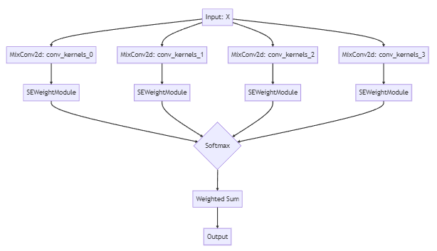

##  以下是MutilScaleAttention注意力机制的理论公式：

空间多尺度注意力机制 (Spatial Multi-Scale Attention):

对于每个尺度 i (i = 1, 2, ..., num_scales)，我们计算空间注意力图 A_s_i 如下：

A_s_i = f_s_i(x)

其中 f_s_i(x) 是具有不同 dilation 参数的卷积运算，用于扩展感受野以捕获第 i 个尺度的上下文信息。
接下来，将所有尺度的空间注意力图相加，得到综合空间注意力图 A_s：

A_s = Σ A_s_i

通道注意力机制 (Channel Attention):
计算全局平均池化 (GAP) 和全局最大池化 (GMP)：

GAP_x = GAP(x)
GMP_x = GMP(x)

将 GAP_x 和 GMP_x 分别输入一个全连接层 f_c(x)，得到通道注意力向量 A_c_avg 和 A_c_max：

A_c_avg = f_c(GAP_x)
A_c_max = f_c(GMP_x)

将 A_c_avg 和 A_c_max 相加，得到综合通道注意力向量 A_c：

A_c = A_c_avg + A_c_max

注意力机制的结合：
将空间多尺度注意力图 A_s 和通道注意力向量 A_c 结合起来，形成一个综合注意力图 A：

A = A_s ⊙ A_c

其中 ⊙ 表示逐元素乘法。这个综合注意力图 A 既包含空间维度上的信息，也包含通道维度上的信息。
将注意力图 A 应用于输入特征图 x，得到输出特征图 y：

y = x ⊙ A

在这个实现中，我们直接输出经过注意力调整的特征图 y。

## SPPFC or SPPCA
&emsp;&emsp;上述代码实现了一个名为 SPPFC（Spatial Pyramid Pooling - Fast with Channel Attention）的自定义层，结合了空间金字塔池化（SPP）和通道注意力机制。以下是这个自定义层的理论基础和理论公式：  
&emsp;&emsp;空间金字塔池化（Spatial Pyramid Pooling）： SPP 的目标是捕获不同尺度的空间信息。  
&emsp;&emsp;在 SPP 中，输入特征图通过多个具有不同感受野的卷积层进行处理。通过改变卷积核大小和填充，可以在不同尺度下获取空间信息。在 SPPFC 层中，我们使用多个具有不同感受野的卷积层（由参数 k 和 conv_groups 控制）来实现空间金字塔池化。  
&emsp;&emsp;这部分的理论公式如下：
对于每个卷积层 i (i = 1, 2, ..., num_layers)，我们计算特征图 X_i 如下：
X_i = f_c_i(x1)
其中 f_c_i(x1) 是具有不同卷积核大小和组数的卷积运算。  
&emsp;&emsp;接下来，将所有层的特征图与原始特征图 x1 连接起来，得到一个综合特征图 X：
X = [x1, X_1, X_2, ..., X_i]  
&emsp;&emsp;通道注意力机制 (Channel Attention)： 通道注意力的目标是在通道维度上突出显示重要特征。在 SPPFC 层中，我们首先通过卷积层 cv2 减少通道数。然后，使用自适应平均池化层 avg_pool1 计算全局信息。接下来，将全局信息传递给全连接层 fc，得到通道注意力权重 A：  
&emsp;&emsp;A = fc(avg_pool1(cv2(X)))  
&emsp;&emsp;整合空间金字塔池化和通道注意力：   
&emsp;&emsp;最后，将通道注意力权重应用于输入特征图 x，得到输出特征图 y：
y = x ⊙ A
&emsp;&emsp;其中 ⊙ 表示逐元素乘法。这个输出特征图 y 既包含了不同尺度的空间信息，也包含了通道维度上的重要特征。

&emsp;&emsp;考虑到这个自定义层结合了空间金字塔池化（SPP）和通道注意力机制，我建议将其命名为“SPPCA”（Spatial Pyramid Pooling with Channel Attention）。这个名称更直观地反映了层的功能和特点，同时简洁明了。  

&emsp;&emsp;&emsp;&emsp;因此，自适应多尺度空间和通道注意力机制能够自适应地学习多尺度空间和通道注意力权重，并在不增加网络参数的情况下提高神经网络的性能。该注意力机制的主要优势在于它能够捕获更全面的特征信息，并在通道维度上突出显示重要特征。此外，它能够自适应地调整不同尺度和通道的重要性，从而更好地适应复杂的图像场景和任务。

"""
## PSAModule_s
这个PSAModule_s模块是一个用于处理特征图的多尺度卷积结构，它结合了不同大小的卷积核和注意力机制，以提取输入特征图的多尺度信息。在这个模块中，主要包含以下几个部分：
分割特征图（Split）：输入特征图 x 被分割成四部分 (x1, x2, x3, x4)，每部分具有不同的通道数（self.dimplanes）。
多尺度卷积（Multi-scale Convolution）：每个子特征图分别通过不同大小的卷积核进行卷积操作，得到多尺度特征 (x1, x2, x3, x4)。
注意力机制（Attention Mechanism）：使用 ECA 注意力模块（ECAAttention）处理每个子特征图，得到相应的注意力权重。
权重求和（Weighted Sum）：根据注意力权重，对四个子特征图进行加权求和。
这个模块的主要目的是提取输入特征图的多尺度信息，并利用注意力机制调整每个尺度的权重。这种结构可以用以下数学公式表示：
分割特征图：
X = [x1, x2, x3, x4]
多尺度卷积：
xi' = conv(xi, kernel_size=conv_kernels[i], padding=conv_kernels[i]//2, stride=stride, groups=conv_groups[i]), i=0,1,2,3
注意力机制：
ai = ECAAttention(xi')
权重求和：
Y = softmax(a0) * x0' + softmax(a1) * x1' + softmax(a2) * x2' + softmax(a3) * x3'
其中，Y 是最终的输出特征图。
## PSAMix是相似的两个版本

这是一个名为PSAMix（Pyramid Spatial Attention Mix）的注意力模块。它旨在捕捉输入特征图的多尺度空间信息，并通过自适应的通道注意力机制强化关键区域的特征。PSAMix模块结合了金字塔形的空间尺度和通道注意力的思想。
以下是模块的主要组成部分：
混合卷积层（self.conv_1, self.conv_2, self.conv_3, self.conv_4）：这些卷积层具有不同的内核大小，由conv_kernels参数指定。这些卷积层可以捕捉输入特征图的多尺度空间信息。输入特征图的通道数由inplans参数指定，输出特征图的通道数由planes参数指定。
通道注意力模块（self.se）：SEWeightModule是一个Squeeze-and-Excitation（SE）注意力模块，用于学习通道注意力权重。这些权重可以强化输入特征图中关键区域的特征。
分组通道数（self.split_channel）：将特征图的通道数分为四组，以便在金字塔形的空间尺度上处理。
Softmax层（self.softmax）：用于计算每个通道的归一化注意力权重。
在前向传播过程中：
首先，输入特征图x分别通过具有不同内核大小的混合卷积层（self.conv_1, self.conv_2, self.conv_3, self.conv_4），得到多尺度特征图（x1, x2, x3, x4）。
然后，将这些特征图沿通道维度拼接起来，形成feats。
接下来，将x1, x2, x3, x4分别通过通道注意力模块self.se，得到相应的注意力权重x1_se, x2_se, x3_se, x4_se。
再将这些注意力权重沿通道维度拼接起来，形成x_se。
通过Softmax层计算归一化的注意力权重attention_vectors。
将feats与attention_vectors相乘，得到加权特征图feats_weight。
最后，将加权特征图沿通道维度拼接起来，形成输出特征图out。
PSAMix模块的设计可以捕捉输入特征图的多尺度空间信息，并通过自适应的通道注意力机制强化关键区域的特征
##  PSAMix 
这个模块是一个自适应多尺度空间注意力卷积模块（Adaptive Multi-scale Spatial Attention Convolution, AMSAC）。它基于多尺度卷积核和空间注意力机制来处理不同尺度的特征。理论公式如下：
假设输入特征图为X，其中X ∈ R^(BxCxHxW)，B表示批次大小，C表示通道数，H和W分别表示特征图的高和宽。

对于每个尺度的卷积核，我们首先应用一个卷积操作。在这个模块中，我们使用了4个不同尺度的卷积核：conv_kernels=[[3, 3],[3, 5],[5, 7],[7, 9]]。每个卷积核的输出特征图表示为X_i (i=1,2,3,4)。

使用空间注意力模块（SEWeightModule）计算每个尺度的注意力权重。空间注意力模块接收输入特征图X_i，并计算其空间注意力权重A_i，其中A_i ∈ R^(BxCx1x1)。

对每个尺度的特征图应用对应的空间注意力权重，得到加权特征图：Y_i = X_i * A_i。

将所有加权特征图在通道维度上进行拼接，得到输出特征图Y：Y = [Y_1, Y_2, Y_3, Y_4]。

通过这个模块，网络能够自适应地选择和聚合不同尺度的特征，以更好地捕捉和处理多尺度信息。

## LightweightSPPFA
这是一个轻量级的空间金字塔池化注意力模块（Lightweight Spatial Pyramid Pooling Feature Attention, Lightweight SPPFA）。它旨在捕捉输入特征图（feature map）的不同空间区域的信息，并通过自适应注意力机制增强关键区域的特征。这个模块结合了空间金字塔池化（Spatial Pyramid Pooling, SPP）和通道注意力（Channel Attention）的思想。
以下是模块的主要组成部分：
卷积层（self.cv1）：将输入特征图的通道数从c1减少到c2，这有助于减少计算量。
最大池化层（self.m）：执行最大池化操作。通过改变内核大小，可以捕捉输入特征图的不同空间尺度上的信息。这里使用相同的内核大小k和步长为1的最大池化层，以获得不同空间尺度的特征图。
自适应平均池化层（self.avg_pool1）：将特征图池化为大小为1x1的全局特征描述符。
全连接层（self.fc）：由两个线性层组成，中间包含ReLU激活函数。这个模块用于学习通道注意力权重。通过减少中间层的通道数（除以reduction），可以减少计算量和参数数量。
在前向传播过程中：
首先，输入特征图x通过self.cv1，得到x1；
然后，使用最大池化层self.m对x1进行多次池化，得到不同空间尺度的特征图（y1, y2, 和self.m(y2)）；
接下来，将这些特征图沿通道维度拼接起来，形成out；
将out通过自适应平均池化层self.avg_pool1，得到全局特征描述符；
再将全局特征描述符通过全连接层self.fc，得到通道注意力权重b；
最后，将输入特征图x与通道注意力权重b相乘，得到输出特征图。
该轻量级空间金字塔池化注意力模块可以捕捉输入特征图的不同空间尺度上的信息，并通过通道注意力机制强化关键区域的特征。这种设计可以提高网络的表示能力，同时减少计算量和参数数量。
"""